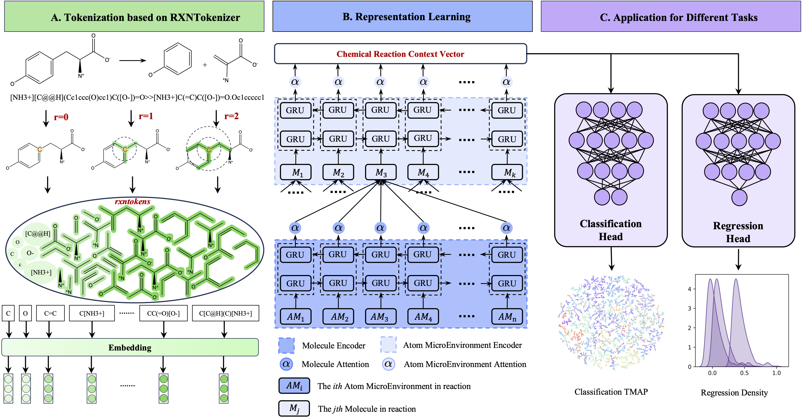

# HiRXN: Hierarchical Attention-Based Representation Learning for Chemical Reaction Prediction



Chemical reaction representations provide a link between machine learning models and chemistry prediction tasks and enable the translation of complex chemical processes into a format that ML models can understand and learn from.  
HiRXN learn hierarchical representation for chemical reactions based on hierarchical attention-based model.
- In order to significantly enhance feature engineering for ML models, HiRXN develops an effective tokenization method called RXNTokenizer to capture atomic microenvironment features with multi-radius. 
- Then, the hierarchical attention network is used to integrate information from atomic microenvironment-level and molecule-level to accurately understand chemical reactions.
- Our method shows remarkable performance in terms of reaction regression and classification prediction tasks.


## Install

```console
conda create -n hirxn python=3.8 -y
conda activate hirxn
conda install pytorch==1.13.1 torchvision==0.14.1 torchaudio==0.13.1 cpuonly -c pytorch
pip install rdkit requests pika pandas numpy tqdm gensim nltk 
```

## Citation
Our work has been published in the [Journal of Chemical Information and Modeling](https://doi.org/10.1021/acs.jcim.4c01787).
```
@article{doi:10.1021/acs.jcim.4c01787,
author = {Cao, Yahui and Zhang, Tao and Zhao, Xin and Li, Haotong},
title = {HiRXN: Hierarchical Attention-Based Representation Learning for Chemical Reaction},
journal = {Journal of Chemical Information and Modeling},
volume = {0},
number = {0},
pages = {null},
year = {0},
doi = {10.1021/acs.jcim.4c01787},
URL = {https://doi.org/10.1021/acs.jcim.4c01787},
eprint = {https://doi.org/10.1021/acs.jcim.4c01787}
}

```